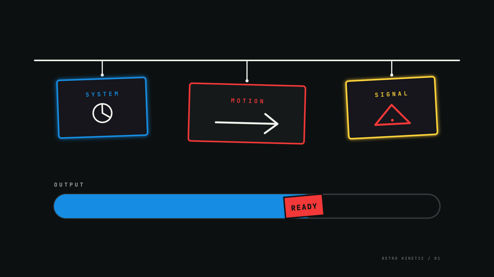

# Omarchy Retro Kinetic Theme

A dark, graphic Omarchy theme inspired by retro instructional motion design:
near-black fields, off-white type, electric primary colors, and bold outlined
geometry.



## Install

```bash
omarchy theme install https://github.com/gardnmi/omarchy-retro-kinetic-theme
```

## Palette

| Role | Hex |
| --- | --- |
| Background | `#0D1011` |
| Raised background | `#1A1E20` |
| Foreground | `#F2F3EE` |
| Blue accent | `#168DE2` |
| Signal red | `#F23838` |
| Signal yellow | `#FFD43B` |
| Muted | `#676D70` |

The full terminal palette is defined in [`colors.toml`](colors.toml). Icons use
`Yaru-blue`.

## Design Notes

- Near-black surfaces preserve the high-contrast editorial look.
- Three-pixel blue borders echo the outlined cards and gauges of kinetic infographics.
- Red and yellow are reserved for alerts, recording states, and warnings.
- The wallpaper is original artwork built from simple line geometry for this theme.

## Inspiration

Heavily inspired by the visual language of retro kinetic infographics and
minimal editorial motion graphics. No assets from the reference video are
included.

## License

MIT
