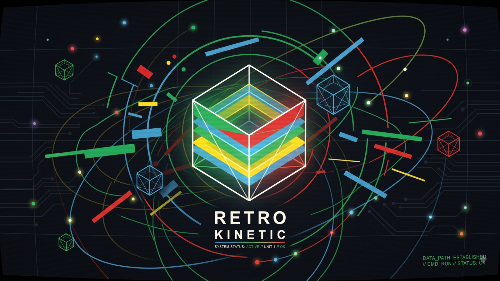

# Omarchy Retro Kinetic Theme

A dark, graphic Omarchy theme inspired by retro instructional motion design:
near-black fields, off-white type, electric primary colors, and bold outlined
geometry.



Includes three wallpapers. The kinetic system cube is the default; use
`omarchy theme bg next` to cycle through the stripe and orbit alternatives.

## Install

```bash
omarchy theme install https://github.com/gardnmi/omarchy-retro-kinetic-theme
```

## Palette

| Role | Hex |
| --- | --- |
| Background | `#0D1011` |
| Raised background | `#1A1D1E` |
| Foreground | `#F2F3EE` |
| Blue accent | `#168DE2` |
| Signal red | `#F23838` |
| Signal yellow | `#FFFF00` |
| Success green | `#20C967` |
| Muted | `#777C7A` |

The full terminal palette is defined in [`colors.toml`](colors.toml). Icons use
`Yaru-blue`.

Omarchy applies matching native themes to Chromium-family browsers, Neovim,
Obsidian, Helix, btop, Walker, Mako, supported terminals, and the lock screen.
Chromium may require a full restart after switching themes. Its Material UI
derives elevated gray surfaces from the configured black seed rather than using
the desktop background color literally.

An optional truecolor OpenCode theme is included at
[`integrations/opencode.json`](integrations/opencode.json). Install it as
`~/.config/opencode/themes/retro-kinetic.json` and select `retro-kinetic` in
`~/.config/opencode/tui.json`.

## Design Notes

- Near-black surfaces preserve the high-contrast editorial look.
- Three-pixel blue borders echo the outlined cards and gauges of kinetic infographics.
- Red and yellow are reserved for alerts, recording states, and warnings;
  green marks successful and completed states.
- ANSI colors collapse onto blue, red, yellow, green, and off-white so terminal syntax
  stays inside the visual language instead of introducing unrelated hues.
- ANSI cyan maps to signal red, giving terminal interfaces a regular red
  structural accent instead of reserving red only for errors.
- The wallpaper is original raster artwork built around four bold retro stripes.

## Inspiration

Heavily inspired by the visual language of retro kinetic infographics and
minimal editorial motion graphics. No assets from the reference video are
included.

## License

MIT
